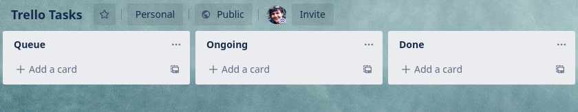
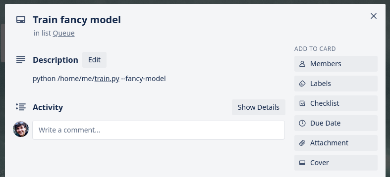
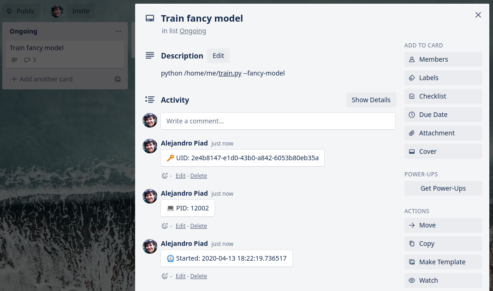
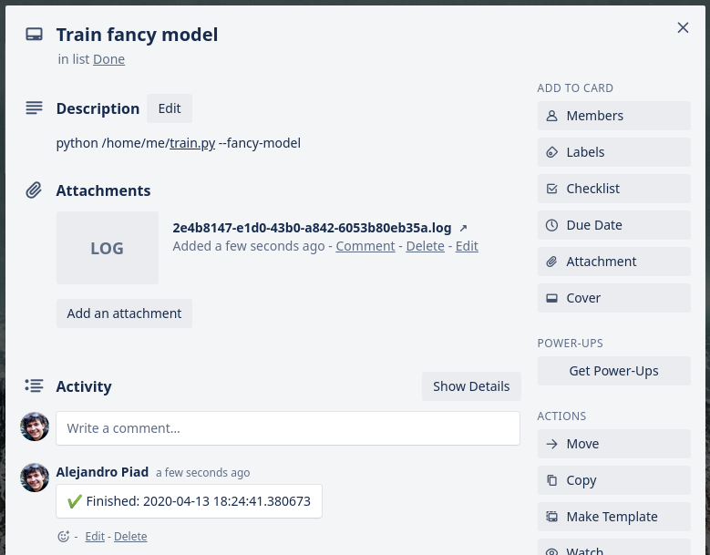

# Trello Tasks

Using Trello as frontend and Python as backend to build a simple task scheduler.

## Installation

    pip install trellotasks

## An example use case

Let's say you have a server somewhere that some users share, and everybody is allowed
to run long and heavy tasks, say, training some machine learning models or something fancy like that.
Your users would usually `ssh` into the server and run their stuff for hours or days.
So you naturally use a Trello board to organize things and keep track of who is running what
and it what state.

Yo create a Trello board with at least three lists, let's call them `Queue`, `Ongoing`, and `Done`.



To declare that you want to start a task, any user creates a card on the `Queue` list, with some
fancy title. Now, here is where the magic starts. In the **description**, you enter the command
that must be executed (we'll talk about security later on, for now let's assume your users
are trustworthy, since they have `ssh` access anyway to the server).



Now `trellotasks` is running in your server in the background, watching the `Queue` list.
As soon as a new card appears, it will take it, read the description, schedule that command,
and move it to the `Ongoing` list. It will also add some comments indicating when
the task was scheduled and the process ID under which it is running.



When that process finishes, `trellotasks` will move the corresponding card to the `Done` queue.
And that's it! It will even attach a conveniently named log file to your card where your process
can dump whatever you need.



## How to get it working

You will need a [Trello API key and secret](https://trello.com/1/appKey/generate).
Then, create a `config.yml` file somewhere, with the following content:

```yaml
auth:
  api_key: <API_KEY>
  api_secret: <API_SECRET>

boards:
  - id: <BOARD-ID> # This is the last part of the board URL
    
    # You can decide how to name these three lists,
    # any other list in the board will not
    # be touched
    queue_list: "Queue"     
    ongoing_list: "Ongoing" 
    done_list: "Done"       

    # The command to execute, explained below
    command: "bash -c '{msg}' > {uid}.log" 

    # How many seconds to wait between each poll to Trello
    poll_time: 3    
    
    # Maximum number of concurrent tasks
    limit: 5
    
    # Manage resources using labels, explained below
    resources:
      Resource A: 1
      Resource B: 2
```

Finally just run:

    python -m trellotasks --config <path/to/config.yml>

In the `command` field you can enter a string that will be executed in a shell
using `subprocess`. You can interpolate two values in this string: `msg` is the
text that appeared in the card description, copied verbatim; `uid` is a unique
identifier that you can use, for example, to write to a log file. If this log
file exists, it will be attached to the card on completion (or error).

You can simply take use `command: bash -c '{msg}'` and let your users have full access to
the shell, however, if you want extra security, make sure to wrap you user's 
command with something else that's under your control.

### Managing resources and concurrency

By default `trellotasks` will take all cards in `Queue` and run the corresponding commands,
up to `limit` tasks. When the number of cards in `Ongoing` is equal to `limit` it will
wait until one is finished before scheduling a new one. If you don't want this behavior,
simply don't include the `limit` key, or set it to `limit: 0`.

If you want more control over what is executed when, you can use Trello labels to define
abstract "resources". A resource is anything that you want to restrict how many tasks
can use, for example, the CPU, the GPU, some ports, whatever. Just make a label for any
of these "resources".

Then use the `resources` list in `config.yml` to restrict how many "instances" of each
resource can be used at most. Every card that is labeled with one or more of these resources
will increase a counter, and no card will be scheduled unless the corresponding resource
is available. 

For example, say you want up to 8 parallel tasks at the same time using the `CPU`
and two using the `GPU` (because you have two GPUs). You can create a label
named `CPU` (or, for the matter, you can just name it `Bob`) and another named `GPU`
and declare in your `config.yml`:

```yaml
# ...
boards:
  - id: # ...
    resources:
      CPU: 8
      GPU: 2
```

Just remember, these labels don't mean anything per-se. It is up to your cards to honor
the system and correctly declare with labels the resources they use.

## Collaboration

Code is MIT, and all collaboration is accepted! Just open a pull request or issue at any time.
